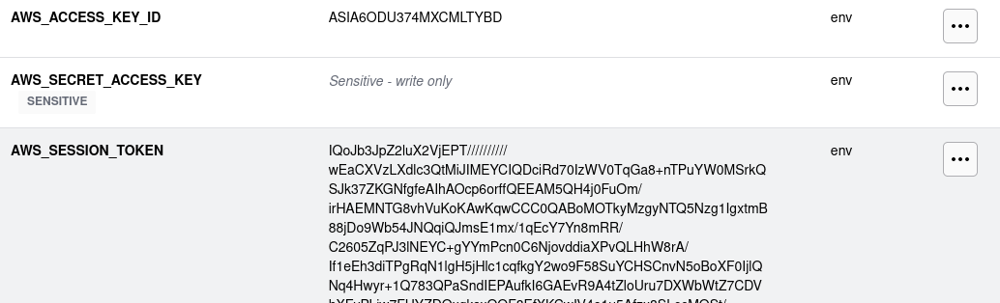
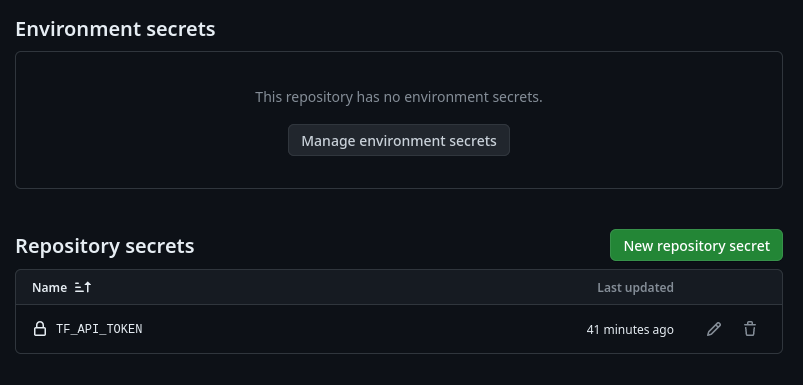
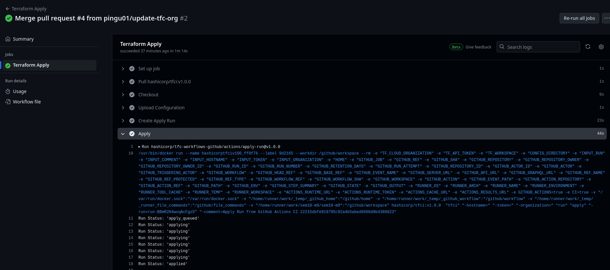
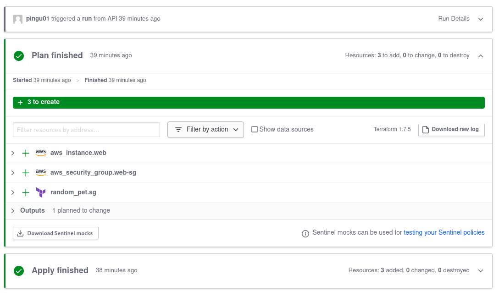

# Atividade Semana 10

## Tecnologias
Para realizar essa atividade, utilizei o Terraform Cloud, que é um serviço que realiza diversas tarefas, como integração contínua, controle de acesso, gerenciamento centralizado, entre outras. 
Além disso, foi utilizado o GitHub e a AWS Academy.

## Etapas
Antes de tudo, devemos criar uma organização e um workspace no Terraform.

A primeira etapa é colocar as variáveis de acesso da AWS no Terraform para poder fazer o deploy automático.

Após isso, devemos copiar o template disponibilizado no tutorial, e adicionar um Secret que é disponibilizado no Terraform.

E então, é necessário mudar o nome da organização no código disponibilizado, as mudanças estão nos arquivos <a href=".github/workflows/terraform-apply.yml">Terraform Apply</a> e <a href=".github/workflows/terraform-plan.yml">Terraform Plan</a>.

Por fim devemos adicionar essas mudanças em uma nova branch, e fazer um Pull Request, e verificar o status da mudança na aba Actions do repositório. 

No Terraform podemos ver que a instância EC2 foi criada.
